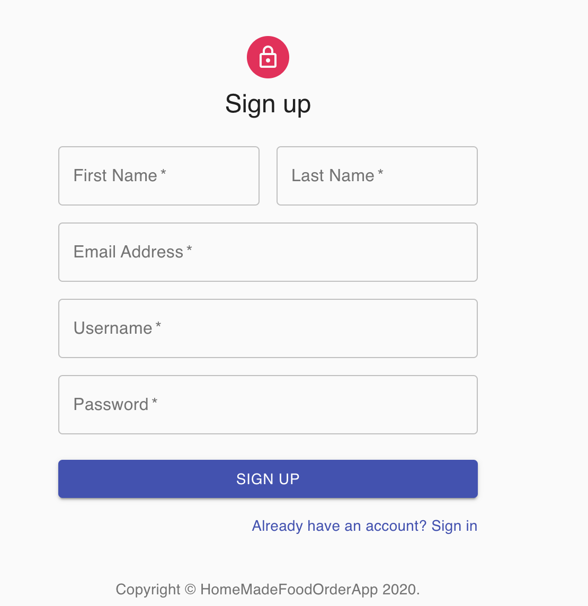
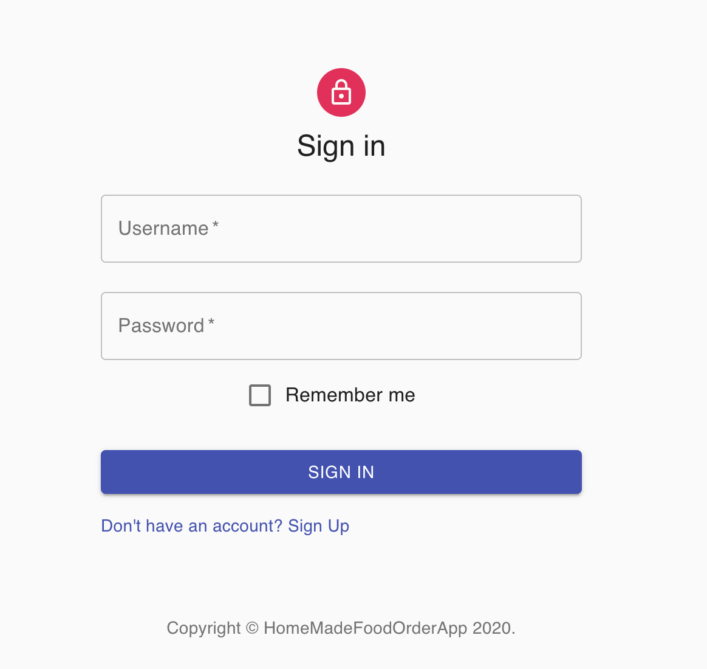
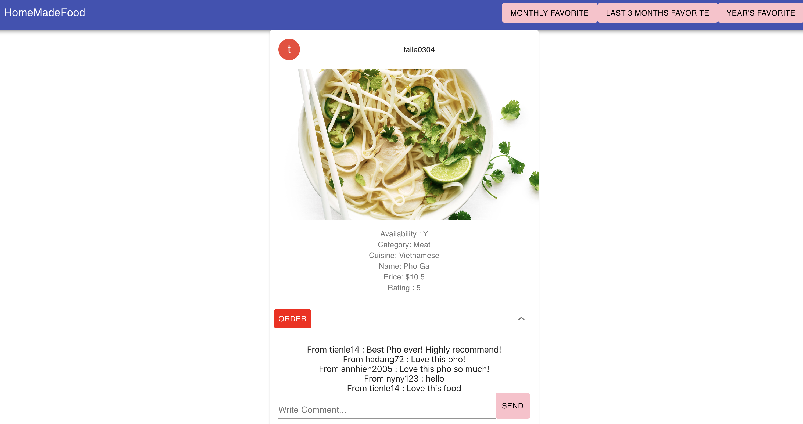
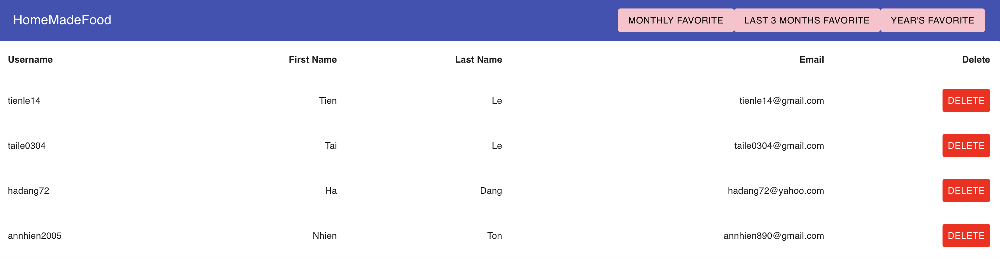

# Homemade Food Order 
This project is an individual project for my database class. The goal of this project is to show my understanding of EER model and relational schema.
I decided to buil a full stack applcation that enables users to browse, comment, and order home-made food. 
This project is coded in Python3.
## Getting Started
### Pre-requisites and Local Development
- You should already have Python3, pip, node, sqlite3 installed on your local machines
- To create a virtual environment on MacOS, run:
```python3 -m venv env```
- To activate the virtual environment, run:
```source env/bin/activate```
## About the Stack
### Backend
- On MacOS, to set up all the dependencies and to run the application on your local machine, run:
```
pip install -r requirements.txt

cd back_end

export FLASK_APP=main.py 

python -m flask run
```

### Frontend
- Installing dependencies and to run the front-end, run:

```
cd homemadefood


npm install


npm start 
```


## Files that are written by me:
- data.sql
- main.py
- All files in homemadefood > src > components
- App.js
- Credit: I used some templates from material-ui to display tables, menu bar, buttons, etc. in my front end (Link: https://material-ui.com/). I modified the template to work with my data returned by my back-end, and also modified it according to my design purposes. 
- Disclaimer: The images URLs I used for the "Photo" table in my database were found on Google Image. I do not own any photos in my database. If the images were a copyright issue, please contact me so that I will remove them.
## GUI References 
```
http://localhost:3000/signUp
```


```
http://localhost:3000/signIn
```



```
http://localhost:3000/posts
```


```
http://localhost:3000/users

```



- NOTE: Please read through API references if you want to test different endpoints. The GUI did not have all buttons that link to other endpoints that I implemented in the backend. For example, if you want to see revenue of user "taile0304" for November, you can go to:
```
http://localhost:3000/users/taile0304/11/monthlyrevenue
```

## API References
The API will return these error types when requests fail:
- 404: Not Found
- 422: Unprocessable
### Endpoints
#### GET /posts
- General: Get all food posts. This endpoint returns a list of all food posts, cursor (number of posts per page), and success value
- Sample: 
```
{
cursor: 2,
posts: [
{
availability: "Y",
category: "Meat",
commentID: "1,2,5,6",
cuisine: "Vietnamese",
foodID: 1,
foodName: "Pho Ga",
photoURL: "https://static.onecms.io/wp-content/uploads/sites/19/2016/01/08/quick-chicken-pho-su.jpg,https://grubarazzi.com/wp-content/uploads/2020/01/Homemade-Chicken-Pho.jpg",
price: 10.5,
rating: 5,
sellerUsername: "taile0304"
},
{
availability: "Y",
category: "Meat",
commentID: null,
cuisine: "Thai",
foodID: 2,
foodName: "Pad Thai",
photoURL: "https://www.recipetineats.com/wp-content/uploads/2020/01/Chicken-Pad-Thai_9-SQ.jpg,https://images.pexels.com/photos/1640777/pexels-photo-1640777.jpeg",
price: 11.5,
rating: 3,
sellerUsername: "hadang72"
}
],
success: true} 
``` 
#### GET /comments/<int:commentID>
- General: Get comments by ids. This endpoint returns a list of comment objects and success value
- Sample: 
```{
comment: {
commentID: 2,
content: "Love this pho!",
datePosted: "2020-12-02",
foodID: 1,
username: "hadang72"
},
success: true
}
```
#### GET /<string:username>/orderhistory
- General: Get order history. This endpoint returns a list of posts objects with information about an user's order history and success value
- Sample:
```
{
posts: [
{
customerUsername: "katen",
dateOrdered: "2020-11-02",
foodID: 3,
orderID: 2,
quantity: 1,
sellerUsername: "thaitran78"
},
{
customerUsername: "katen",
dateOrdered: "2020-10-20",
foodID: 16,
orderID: 18,
quantity: 1,
sellerUsername: "Gigi"
}
],
success: true
}
```
#### GET /posts/<int:foodID>/
- General: Get food posts by food ID. This endpoint returns a list of posts objects with information about the food and success value.
- Sample:
```{
posts: [
{
availability: "Y",
category: "Vegan",
commentID: null,
cuisine: "American",
foodID: 10,
foodName: "Meatless burger",
photoURL: "https://d279m997dpfwgl.cloudfront.net/wp/2019/05/AP_19123667719470-1000x667.jpg",
price: 11.5,
rating: 4.5,
sellerUsername: "taile0304"
}
],
success: true
}
```
#### GET /posts/mostpopular/<int:month>/2020/
- General: Get the most purchased food in a month. This endpoint returns the post object with information of the food that was most purchased in that month and success value.
- Sample:
```{
posts: [
{
availability: "Y",
category: "Vegetarian",
commentID: null,
cuisine: "Indian",
foodID: 29,
foodName: "Chickpea Curry",
photoURL: "https://myfoodstory.com/wp-content/uploads/2018/08/Cauliflower-Chickpea-Coconut-Curry-1.jpg",
price: 8.5,
rating: 5,
sellerUsername: "taile0304"
}
],
success: true
}
```

#### GET /posts/mostpopular/last3months/
- General: Get the most purchased food in the last 3 months. This endpoint returns the post object with information of the food that was most purchased in the last 3 months and success value.
- Sample: 
```
{
posts: [
{
availability: "Y",
category: "Meat",
commentID: "1,2,5,6",
cuisine: "Vietnamese",
foodID: 1,
foodName: "Pho Ga",
photoURL: "https://static.onecms.io/wp-content/uploads/sites/19/2016/01/08/quick-chicken-pho-su.jpg,https://grubarazzi.com/wp-content/uploads/2020/01/Homemade-Chicken-Pho.jpg",
price: 10.5,
rating: 5,
sellerUsername: "taile0304"
}
],
success: true
}
```
#### GET /posts/mostpopular/<int:year>/
- General: Get the most purchased food in a year. This endpoint returns the post object with information of the food that was most purchased in the year of 2020 and success value.
- Sample:
```
{
posts: [
{
availability: "Y",
category: "Meat",
commentID: "1,2,5,6",
cuisine: "Vietnamese",
foodID: 1,
foodName: "Pho Ga",
photoURL: "https://static.onecms.io/wp-content/uploads/sites/19/2016/01/08/quick-chicken-pho-su.jpg,https://grubarazzi.com/wp-content/uploads/2020/01/Homemade-Chicken-Pho.jpg",
price: 10.5,
rating: 5,
sellerUsername: "taile0304"
}
],
success: true
}
```
#### GET /users/<string:username>/posts
- General: Get posts by username. This endpoint returns all the food posts that have been posted by the user.
- Sample:
```{
posts: [
{
availability: "Y",
category: "Vegan",
commentID: null,
cuisine: "Indian",
foodID: 30,
foodName: "Palak Paneer",
photoURL: "https://www.earthboundfarm.com/wp-content/uploads/2019/06/Palak-Paneer.jpg",
price: 8.5,
rating: 4.8,
sellerUsername: "hoapham123"
}
],
success: true
}
```
#### GET /users/
- General: Get all users. This endpoint returns a list of post objects that contain email, firstName, lastName, and username of all users.
- Sample: 
```
{
posts: [
{
email: "tienle14@gmail.com",
firstName: "Tien",
lastName: "Le",
username: "tienle14"
},
{
email: "taile0304@gmail.com",
firstName: "Tai",
lastName: "Le",
username: "taile0304"
},
{
email: "hadang72@yahoo.com",
firstName: "Ha",
lastName: "Dang",
username: "hadang72"
},
{
email: "annhien890@gmail.com",
firstName: "Nhien",
lastName: "Ton",
username: "annhien2005"
},
{
email: "vinhlang71@outlook.com",
firstName: "Lang",
lastName: "Vinh",
username: "vinhlang123"
},
{
email: "johns62@gmail.com",
firstName: "John",
lastName: "Smith",
username: "johns62"
},
{
email: "katen175@gmail.com",
firstName: "Kate",
lastName: "Nathaniel",
username: "katen"
},
{
email: "anniejones@yahoo.com",
firstName: "Annie",
lastName: "Jones",
username: "annie95"
},
{
email: "mokim@yahoo.com",
firstName: "Mo",
lastName: "Kim",
username: "momo123"
},

success: true
}
```
#### GET /users/<string:username>/<int:month>/monthlyrevenue
- General: Get monthly revenue. This endpoint returns month, monthlyRevenue, sellerUsername, and success value.
- Sample:
```{
Month: "11",
monthlyRevenue: 247.5,
sellerUsername: "taile0304",
success: true
}
```
#### GET /users/<string:username>/<int:year>/annualrevenue
- General: Get annual revenue. This endpoint returns Year, annualRevenue, sellerUsername, and success value.
- Sample:
```
{
Year: "2020",
annualRevenue: 998,
sellerUsername: "taile0304",
success: true
}
```
#### GET /userssince/<int:year>
- General: Get all accounts that were created in a specific year. This endpoint returns number of users created that year, success value, year, and list of user objects that contain information of the users.
- Sample: 
```
{
NumUsersCreatedThisYear: 24,
Success: true,
Year: "2020",
listOfUsers: [
{
dateCreated: "2020-01-01",
email: "vinhlang71@outlook.com",
firstName: "Lang",
lastName: "Vinh",
password: "langv71!",
username: "vinhlang123"
},
{
dateCreated: "2020-01-02",
email: "johns62@gmail.com",
firstName: "John",
lastName: "Smith",
password: "johnpassword123",
username: "johns62"
},
{
dateCreated: "2020-01-03",
email: "katen175@gmail.com",
firstName: "Kate",
lastName: "Nathaniel",
password: "katen123@67",
username: "katen"
}]
}
```
#### GET /highlyratedfood
- General: Get the top 5 food with the highest rating. This endpoint returns a list of post objects that contain information of the top 5 food with highest ranking.
- Sample: 
```
{
posts: [
{
availability: "Y",
category: "Meat",
commentID: "1,2,5,6",
cuisine: "Vietnamese",
foodID: 1,
foodName: "Pho Ga",
photoURL: "https://static.onecms.io/wp-content/uploads/sites/19/2016/01/08/quick-chicken-pho-su.jpg,https://grubarazzi.com/wp-content/uploads/2020/01/Homemade-Chicken-Pho.jpg",
price: 10.5,
rating: 5,
sellerUsername: "taile0304"
},
{
availability: "Y",
category: "Meat",
commentID: null,
cuisine: "Thai",
foodID: 11,
foodName: "Duck curry",
photoURL: "https://static0.thaitable.com/images/recipe/5roast-duck-curry.jpg",
price: 18.5,
rating: 5,
sellerUsername: "momo123"
},
{
availability: "Y",
category: "Meat",
commentID: null,
cuisine: "Korean",
foodID: 13,
foodName: "Kimbap",
photoURL: "https://bakingthegoods.com/wp-content/uploads/2018/08/Fruity-Coconut-Kimbap-39.jpg",
price: 12.5,
rating: 5,
sellerUsername: "shin"
},
{
availability: "Y",
category: "Meat",
commentID: null,
cuisine: "Vietnamese",
foodID: 14,
foodName: "Pho Bo",
photoURL: "https://www.vietworldkitchen.com/wp-content/uploads/2017/09/6a00d8341ef22f53ef01156f84577b970c-500pi.jpg",
price: 10.5,
rating: 5,
sellerUsername: "annie95"
},
{
availability: "Y",
category: "Dessert",
commentID: null,
cuisine: "Italian",
foodID: 15,
foodName: "Tiramisu",
photoURL: "https://food.fnr.sndimg.com/content/dam/images/food/fullset/2011/2/4/2/RX-FNM_030111-Sugar-Fix-005_s4x3.jpg.rend.hgtvcom.826.620.suffix/1371597326801.jpeg",
price: 5.5,
rating: 5,
sellerUsername: "taylors"
}
],
success: true
}
```
#### POST /signup
- General: Lets user sign up for the app. This endpoint creates new user using JSON request parameters (username, firstName, lastName, password, email) and returns success value. 
- Request sample:
```
{
    "username" : "testing",
    "firstName" :"Natalie",
    "lastName": "Portman",
    "email" : "nn@outlook.com",
    "password": "3kdmdl"
    
}
```
- Return value sample: 
```
{
    "success": true
}
```
#### POST /signin
- General: Lets user sign in. This endpoint uses JSON request parameters (username, password) and return success value.
- Return value Sample:
```
{
    "success": true
}
```
#### POST /postcomments
- General: Lets user post comments. This endpoint uses JSON request parameters (username, content, foodID) and returns success value.
- Request sample:
```
{
    "username" : "tienle14",
    "content" :"Love this food",
    "foodID": 1
    
}
```
- Return value sample:
```
{
    "success": true
}
```
#### POST /order
- General: Lets users order food. This endpoint uses JSON request parameters and returns success value.
- Request sample: 
```
{
    "customerUsername" : "tienle14",
    "sellerUsername" : "taile0304",
    "foodID" : 1,
    "quantity": 2
    
}
```
- Return value sample:
```
{
    "success": true
}
```
#### DELETE /users/delete/<string:username>/
- General: Delete users by username. This endpoint return the deleted username and success value.
- Sample: 
```
{
    "deleted": "katen",
    "success": true
}
```
